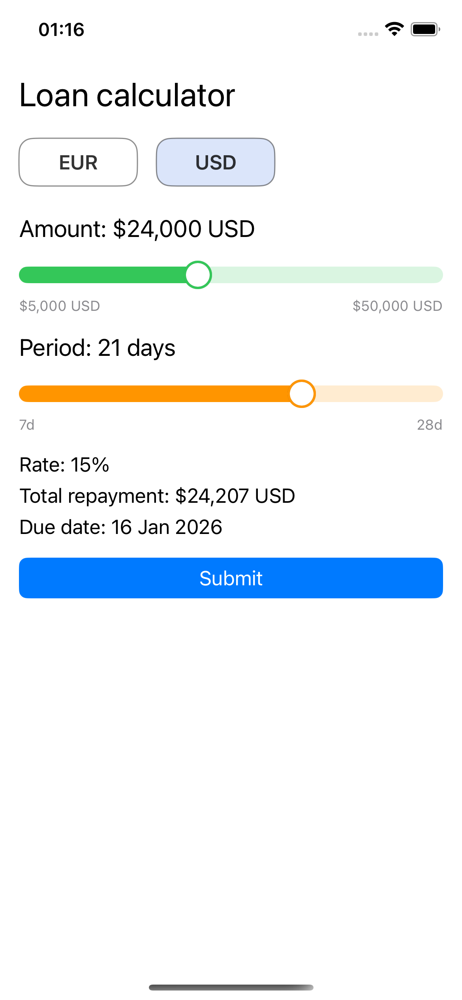
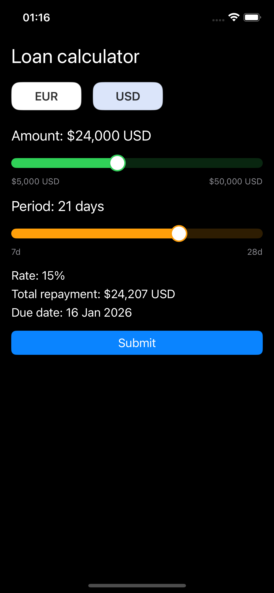

# Loan Calculator (iOS)

A simple loan calculator app built with **SwiftUI** and a lightweight **Store** architecture.
The app allows selecting currency (USD/EUR), adjusting loan amount and period, and submitting the application to a demo API.

## Features
- Currency selector (USD / EUR)
- Amount slider with min/max/step rules
- Period slider with discrete options (7/14/21/28 days) and smooth snapping
- Total repayment and due date calculation
- Submit flow with loader and typed errors
- Persists last selection using `UserDefaults`
- Unit tests for domain logic and store behavior

## Tech Stack
- Swift, SwiftUI
- URLSession (network)
- UserDefaults (persistence)
- XCTest (unit tests)

## Architecture
- **Domain**: rules, calculator, validator, models
- **Data**: API client, repository, DTOs, storage
- **Feature**: state, actions, reducer, store
- **UI**: SwiftUI screen and components

## API
POST request to:
- `https://jsonplaceholder.typicode.com/posts`

Body:
```json
{ "amount": 10000, "period": 14, "totalRepayment": 11500 }
```
## Getting Started
1.    Open LoanCalculator.xcodeproj in Xcode.
2.    Select an iOS Simulator.
3.    Run the app (Cmd + R).

## Running Tests

Run unit tests:
•    Cmd + U

## Screenshots

<p align="center">
  
  
</p>
